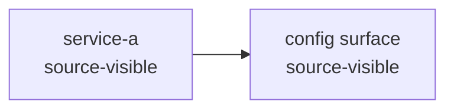

# Contract: E2E Agent Scan Report

## User Request Shape

The harness-facing request is intentionally plain:

```text
Scan the open repository or repository folder with Portolan and prepare a
first report: stack, relationships, architecture diagram, duplication,
technical debt, unknowns, and next actions.
```

The harness may translate this to a CLI command or skill invocation, but the
product contract is the same.

## Required Outputs

```text
<output-dir>/
  context/
    agent-brief.md
    answer-contract.md
    query-plan.md
    evidence-index.jsonl
    repos.json
    tool-registry.json
    oss-plan.json
    gaps.jsonl
  map/
    run.json
    coverage.json
    summary.json
    graph-index.json
    graph.json
    findings.jsonl
    map.md
  report/
    first-report.md
    report-summary.json
```

`first-report.md` is the artifact the agent can return in chat. It must be
derived from the local evidence bundle, not from unsupported agent inference.
The harness workflow must instruct the agent to summarize or relay
`first-report.md` in the chat response after the file is generated.

## Required Report Sections

1. Run status
2. Visible scope
3. Visible stack
4. Relationships and architecture
5. Architecture diagram
6. Duplication
7. Configuration surfaces
8. Technical-debt candidates
9. Unknowns and gaps
10. Ranked next actions

## Architecture Diagram Format

The v1 diagram format is Mermaid embedded in `first-report.md`:

````markdown

````

The diagram must include a legend or labels that distinguish
`source-visible`, `metadata-visible`, `runtime-visible`, `claim-only`,
`unknown`, `cannot_verify`, and `not_assessed` as applicable.

## Evidence Rules

- Positive findings must cite local evidence references.
- `unknown`, `cannot_verify`, and `not_assessed` must remain visible.
- `source-visible` and `metadata-visible` relationships must not be described
  as complete runtime topology.
- Exact duplicate findings must not be described as full near-clone coverage.
- Optional producer absence must be a gap or next action, not a clean result.

## Machine Summary Minimum Shape

```json
{
  "schema_version": "0.1.0",
  "target_root": "/absolute/path",
  "generated_by": "portolan",
  "sections": {
    "run_status": {"status": "present"},
    "visible_scope": {"status": "present"},
    "visible_stack": {"status": "present"},
    "relationships_and_architecture": {"status": "present"},
    "architecture_diagram": {"status": "present"},
    "duplication": {"status": "present"},
    "configuration": {"status": "present"},
    "technical_debt": {"status": "present"},
    "unknowns_and_gaps": {"status": "present"},
    "next_actions": {"status": "present"}
  },
  "positive_claims": [
    {
      "claim": "Exact duplicate source content was observed.",
      "evidence_state": "source-visible",
      "references": ["portolan://bundle/findings/example"]
    }
  ],
  "weak_states": [
    {
      "surface": "runtime topology",
      "state": "not_assessed",
      "reason": "No runtime-visible local observations were supplied."
    }
  ],
  "next_actions": [
    {
      "rank": 1,
      "action": "Run a bounded finding query for duplication.",
      "command": "portolan query findings --bundle <map-dir> --kind duplication --limit 20",
      "requires_approval": false,
      "reduces": "duplication detail"
    }
  ],
  "unsupported_claims": []
}
```

## Acceptance Failure Conditions

The E2E lane fails if:

- `first-report.md` or `report-summary.json` is missing.
- Any required section is missing.
- A positive finding lacks a local evidence reference.
- Runtime topology, full architecture, complete stack coverage, or near-clone
  duplication is claimed without supporting evidence.
- Weak states are absent from the report when present in the evidence bundle.
- Next actions include invented Portolan commands or unsafe default behavior.
- Harness-specific instructions drift from the canonical scan-report workflow
  without a recorded adapter-parity exception.
